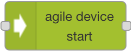
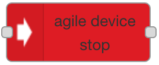

# agile-node-red-nodes

Node-RED nodes no interact with AGILE Gateway.

This repository has forked from <a href="https://github.com/Agile-IoT/agile-node-red-nodes">official Agile Repository</a> by <a href="https://heptasense.com">Heptasense</a>.

The goal of this fork is to extend the functionality available and allow for better control of data flow and device management inside Gateway apps.  

## Getting Started
### Dependencies

You should have a working Agile Gateway IoT installation.

### Instalation


Clone this repository into you Node-RED folder:

```
$ git clone https://github.com/mauro-peixe/agile-node-red-nodes.git
```

Install:
```
$ npm install agile-node-red-nodes .
```
 
Restart you node-red server.

### Usage

Drag and drop the specific node into your Node-RED application.

#### Agile device start Node

This node allows you to start collecting data from a device.




Configuration parameters:
- **server:** Agile server address
- **deviceId:** Device identifier in the Agile Gateway Device Manager
- **componentId:** Device component that you want to start reading
- **name:** Name of the node
   
Output:

After successful start the ``msg.payload`` of the output will the following string, if no error is thrown: 
```
msg.payload = "The device was successfully stopped"
```


Upon data arrival the ``msg.payload`` of the output will contain an AGILE RecordObject, if no error is thrown: 
```
msg.payload = {
  DeviceId: 234324,
  ComponentId: "temperature",
  Value: "14.5",
  Unit: "celsius",
  Format: "degree"
  LastUpdate: 1460693467    
}
```

#### Agile device stop Node

This node allows you to stop collecting data from a device.



Configuration parameters:
- **server:** Agile server address
- **deviceId:** Device identifier in the Agile Gateway Device Manager
- **componentId:** Device component that you want to start reading
- **name:** Name of the node

Output:

The ``msg.payload`` of the output will the following string, if no error is thrown: 
```
msg.payload = "The device was successfully stopped"
```

Both nodes can be pre-configured using the configuration dialog before deploy or can be configured during runtime by passing the configuration parameters in the ``msg.payload`` object:
```
msg = {
    ...
    "payload": {
        "server": {{agile_server_adress}}
        "deviceId: {{device_identifier}}
        ...        
    }
}
```

Note that runtime configuration will overwrite default configuration setup before deployment. 


## Authors

Agile IoT: <a href="http://agile-iot.eu/">www.agile-iot.eu</a>

Heptasense: <a href="http://heptasense.com">www.heptasense.com</a>


